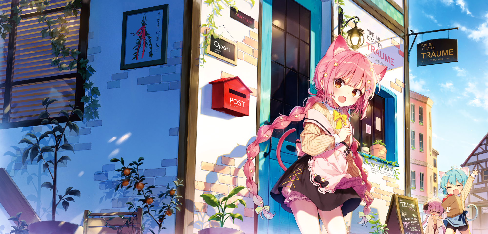

头像来源：CorelDRAW 的一种默认图案填充，原因是 ~~不想被当成傻逼二次元~~ 在不知道该用什么好的情况下随手截的

## 代码偏好

- 语言: C++, Rust, ShellScript, Python, JAVA, Go, ECMAScript, C
- GNU/Linux 发行版: Arch, Debian, NixOS
- 编辑器: Vim, Jetbrains IDE, VScode

## 爱好

- 看番, 轻小说
- 养老 fps 选手，底力不足音游人，旮旯给木玩家
- 睡觉
- 車万(一度非常喜欢，但是现在热情淡了)

## 目标

- 有一个健康的作息
- 锻炼身体
- 好好活着

---

Painted by [shnva](https://www.pixiv.net/en/users/12296581)
